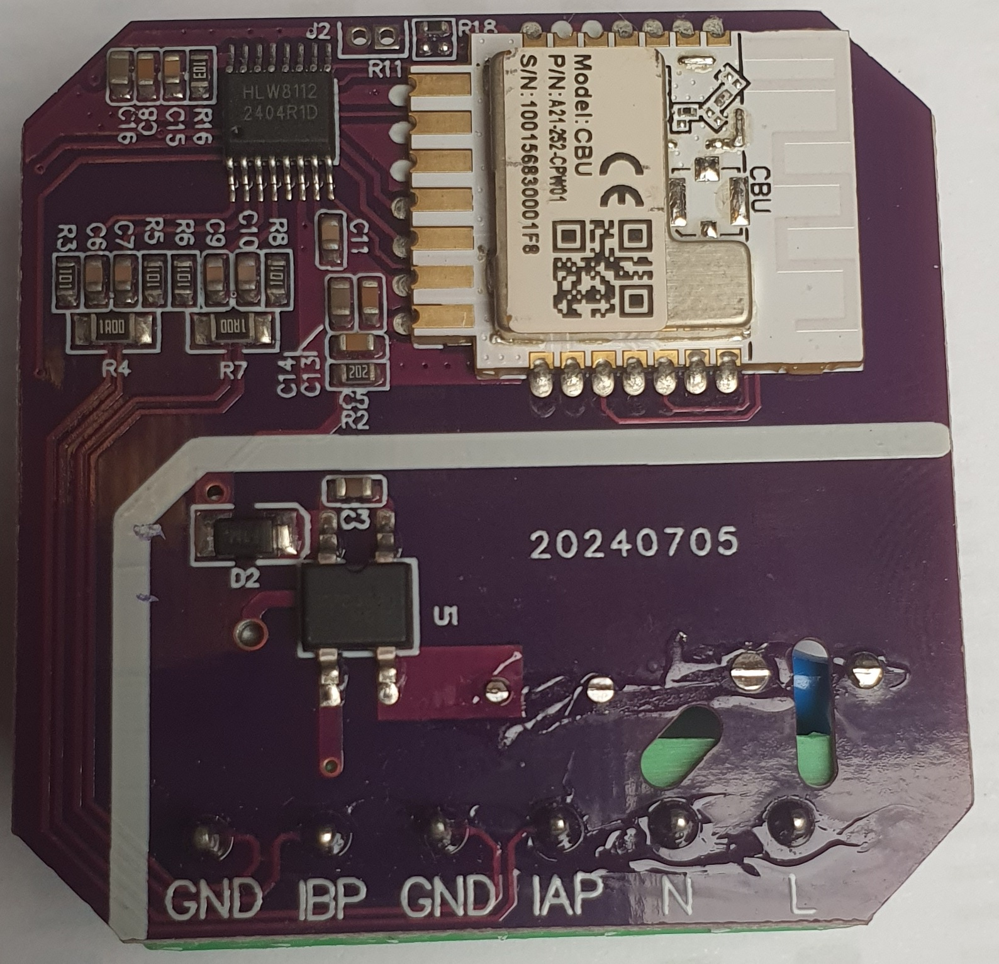
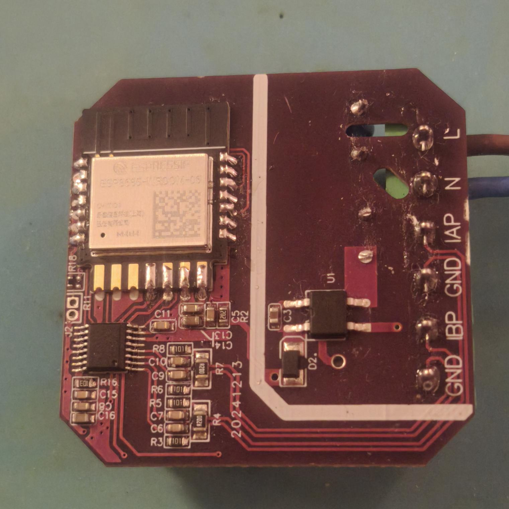

# HLX811x component for ESPHome

The `hlw811x` sensor platform allows you to use your HLW811x voltage/current/power and energy sensors with ESPHome.
This sensor is commonly found in `PM01_A002` WiFi Dual Channel Smart Meter.

> [!WARNING]
> SAFETY HAZARD:
> Some devices have the digital GND connected directly to mains voltage so **the GPIOs become LIVE during normal operation**.
> Our advice is to mark these boards to prevent any use of the dangerous digital pins.

## Hardware limitation

> [!IMPORTANT]
> `PM01_A002` sensor uses HLW8112 in SPI mode and Beken CBU (`BK7231N` module).
> Unfortunately ESPHome doesn't support SPI support for Beken SoC.
> You have to replace CBU, for example with [ESP32-C3 Tuya CBU Replacement Module](https://templates.blakadder.com/ESP8685-WROOM-06.html).




## HLW811x library

This component uses [MahdaSystem/HLW811x Library](https://github.com/MahdaSystem/HLW811x) from [Hossein-M98](https://github.com/Hossein-M98).
The library is based on [HLW811x datasheet](http://www.hiliwi.com/viewfilebizce/2003380736213880832/DS_HLW8110_HLW8112_EN_Rev21.pdf).

## Usage

```yaml
# Example configuration entry
sensor:
  - platform: hlw811x
    id: hlw811x_sensor
    update_interval: 60s

    # SPI
    cs_pin: GPIO10
    clk_pin: GPIO1
    mosi_pin: GPIO2
    miso_pin: GPIO9

    # Swap A / B channels
    swap_AB: true

    # Select current channel for
    #   phase angle, apparent power, power factor,
    #   instantaneous active power and instantaneous apparent power
    channel_sel: "A"

    # Set ratio of resistors IA, IB & U
    res_ratio_IA: 0.2
    res_ratio_IB: 0.2
    res_ratio_U: 1.0

    # Sensor values
    voltage:
      name: "HLW8112 Voltage"
    frequency:
      name: "HLW8112 Frequency"
    power_factor:
      name: "HLW8112 Power Factor"
    phase_angle:
      name: "HLW8112 Phase Angle"
    apparent_power:
      name: "HLW8112 Apparent Power"
    current_a:
      name: "HLW8112 Current A"
    current_b:
      name: "HLW8112 Current B"
    active_power_a:
      name: "HLW8112 Active Power A"
    active_power_b:
      name: "HLW8112 Active Power B"
    energy_a:
      name: "HLW8112 Energy A"
    energy_b:
      name: "HLW8112 Energy B"
    log_registers:
      name: "HLW8112 Registers"
    log_settings:
      name: "HLW8112 Settings"
```

> [!NOTE]
> The configuration above should work for WiFi Dual Channel Smart Meter (`PM01_A002`).

## Configuration variables
- **voltage** (*Optional*): Use the voltage value of the sensor in V (RMS).
  All options from [Sensor](https://esphome.io/components/sensor).
- **frequency** (*Optional*): The AC line frequency of the supply voltage.
  All options from [Sensor](https://esphome.io/components/sensor).
- **power_factor** (*Optional*): Use the power factor value of the sensor.
  All options from [Sensor](https://esphome.io/components/sensor).
- **phase_angle** (*Optional*): Use the phase angle value of the sensor in degrees (°).
  All options from [Sensor](https://esphome.io/components/sensor).
- **apparent_power** (*Optional*): Use the apparent power value of the sensor in volt amps (VA).
  All options from [Sensor](https://esphome.io/components/sensor).
- **current_a** (*Optional*): Use the current value of the sensor's channel A in amperes.
  All options from [Sensor](https://esphome.io/components/sensor).
- **current_b** (*Optional*): Use the current value of the sensor's channel B in amperes.
  All options from [Sensor](https://esphome.io/components/sensor).
- **active_power_a** (*Optional*): Use the (active) power value of the sensor's channel A in watts (W).
  All options from [Sensor](https://esphome.io/components/sensor).
- **active_power_b** (*Optional*): Use the (active) power value of the sensor's channel B in watts (W).
  All options from [Sensor](https://esphome.io/components/sensor).
- **energy_a** (*Optional*): Use the total energy value of the sensor's channel A in Wh.
  All options from [Sensor](https://esphome.io/components/sensor).
- **energy_b** (*Optional*): Use the total energy value of the sensor's channel B in Wh.
  All options from [Sensor](https://esphome.io/components/sensor).

- **channel_sel** (*Optional*, string): Default channel used for measurements (phase angle, apparent power, power factor...).
  Defaults to `A`.
  Possible values are `A` or `B`.

- **update_interval** (*Optional*, [Time](https://esphome.io/guides/configuration-types#time)): The interval to check the sensor.
  Defaults to `60s`.

## Advanced Options

- **cs_pin** (*Optional*, [Pin](https://esphome.io/guides/configuration-types#pin)): The pin CS is connected to.
  Defaults to the `PM01_A002`'s value `GPIO10`.
- **clk_pin** (*Optional*, [Pin](https://esphome.io/guides/configuration-types#pin)): The pin CLK is connected to.
  Defaults to the `PM01_A002`'s value `GPIO1`.
- **mosi_pin** (*Optional*, [Pin](https://esphome.io/guides/configuration-types#pin)): The pin MOSI is connected to.
  Defaults to the `PM01_A002`'s value `GPIO2`.
- **miso_pin** (*Optional*, [Pin](https://esphome.io/guides/configuration-types#pin)): The pin MISO is connected to.
  Defaults to the `PM01_A002`'s value `GPIO9`.

- **swap_AB** (*Optional*, boolean): Specify if the manufacturer swapped the labels for Channel A and Channel B.
  Defaults to the `PM01_A002`'s value `true`.

- **res_ratio_IA** (*Optional*, float): The amplification factor of the sampling resistor for current A measurement.
  Defaults to the `PM01_A002`'s value `0.2`.
- **res_ratio_IB** (*Optional*, float): The amplification factor of the sampling resistor for current B measurement.
  Defaults to the `PM01_A002`'s value `0.2`.
- **res_ratio_U** (*Optional*, float): The amplification factor of the voltage divider resistor for voltage measurement.
  Defaults to the `PM01_A002`'s value `1.0`.

- **log_registers** (*Optional*): Get JSON containing registers.
  All options from [TextSensor](https://esphome.io/components/text_sensor#config-text_sensor).
- **log_settings** (*Optional*): Get JSON containing settings.
  All options from [TextSensor](https://esphome.io/components/text_sensor#config-text_sensor).

## Energy Measurement

The HLW811x energy meter is reset every time the system restarts.
Alternatively, you can use software integration with the power sensor:

```yaml
sensor:
  - platform: hlw811x
    active_power_a:
      name: "HLW8112 Active Power A"
      id: hlw8112_power_a
    active_power_b:
      name: "HLW8112 Active Power B"
      id: hlw8112_power_b
  - platform: total_daily_energy
    name: "Daily Energy A"
    power_id: hlw8112_power_a
  - platform: total_daily_energy
    name: "Daily Energy B"
    power_id: hlw8112_power_b
```

## Actions

## `hlw811x.set_channel_sel` Action

This action can be used to define default channel used for measurements.
```yaml
  - platform: template
    name: "HLW8112 Switch to Channel A"
    on_press:
      - hlw811x.set_channel_sel:
          id: hlw811x_sensor
          channel: "A"

  - platform: template
    name: "HLW8112 Switch to Channel B"
    on_press:
      - hlw811x.set_channel_sel:
          id: hlw811x_sensor
          channel: "B"
```

## `hlw811x.reset_energy` Action

This action can be used to reset energy measurement (set to zero).
```yaml
  - platform: template
    name: "HLW8112 Reset Energy A"
    on_press:
      - hlw811x.reset_energy:
          id: hlw811x_sensor
          channel: "A"

  - platform: template
    name: "HLW8112 Reset Energy B"
    on_press:
      - hlw811x.reset_energy:
          id: hlw811x_sensor
          channel: "B"
```

## `hlw811x.publish` Action

This action can be used to force data publication
```yaml
  - platform: template
    name: HLW8112 Publish
    on_press:
      - hlw811x.publish:
          id: hlw811x_sensor
```

## `hlw811x.display_status` Action

Used for debug, log display configuration and register values
```yaml
  - platform: template
    name: HLW8112 Status
    on_press:
      - hlw811x.display_status:
          id: hlw811x_sensor
```

## Example using onboard button and LED

```yaml
binary_sensor:
  - platform: gpio
    id: sensor_btn
    name: "Sensor Button"
    pin:
      number: GPIO4
      inverted: true
      mode:
        input: true
        pullup: true
    filters:
      - delayed_on: 10ms
    on_press:
      then:
        switch.toggle: switch_led
switch:
  - platform: output
    id: switch_led
    name: "Toggle Led"
    output: sensor_led
output:
  - platform: gpio
    id: sensor_led
    pin: GPIO5
```

## Full Example Config

```yaml
substitutions:
  device_name: "smart-meter"
  friendly_name: "Smart Meter"

  # Swap A / B channels
  swap_AB: "true"

  # Select current channel for
  #   phase angle, apparent power, power factor,
  #   instantaneous active power and instantaneous apparent power
  channel_sel: "A"

  # Set ratio of resistors IA, IB & U
  res_ratio_IA: 0.2
  res_ratio_IB: 0.2
  res_ratio_U: 1.0

  board: esp32-c3-devkitm-1
  BTN_PIN: GPIO4
  LED_PIN: GPIO5
  CS_PIN: GPIO10
  CLK_PIN: GPIO1
  MISO_PIN: GPIO9  # MISO = SDI
  MOSI_PIN: GPIO2  # MOSI = SDO

esphome:
  name: $device_name
  name_add_mac_suffix: true
  friendly_name: $friendly_name
  platformio_options:
    build_flags:
      - -std=c++11
      - -DENV_DEVKIT_ESP32

esp32:
  variant: ESP32C3
  board: ${board}
  framework:
    type: esp-idf

external_components:
  - source:
      type: local
      path: my_components
    components: [ hlw811x ]
    refresh: 0s

# Enable logging
logger:
#  level: DEBUG  # or VERY_VERBOSE for maximum detail

# Enable Home Assistant API
api:
  # Enable Home Assistant API
  homeassistant_services: true
  #password: ""
  #encryption:
  #  key: !secret api_encryption_key

  actions:
    - action: set_channel_sel_a
      then:
        - hlw811x.set_channel_sel:
            id: hlw811x_sensor
            channel: "A"
    - action: set_channel_sel_b
      then:
        - hlw811x.set_channel_sel:
            id: hlw811x_sensor
            channel: "B"
    - action: reset_energy_a
      then:
        - hlw811x.reset_energy:
            id: hlw811x_sensor
            channel: "A"
    - action: reset_energy_b
      then:
        - hlw811x.reset_energy:
            id: hlw811x_sensor
            channel: "B"

ota:
  - platform: esphome
    password: ""

wifi:
  # Enable fallback hotspot (captive portal) in case wifi connection fails
  ap:
    ssid: "ESPHome Fallback"
    password: ""

captive_portal:

web_server:
  port: 80
  version: 3

binary_sensor:
  - platform: gpio
    id: sensor_btn
    name: "Sensor Button"
    pin:
      number: ${BTN_PIN}
      inverted: true
      mode:
        input: true
        pullup: true
    filters:
      - delayed_on: 10ms
    on_press:
      then:
        switch.toggle: switch_led
switch:
  - platform: output
    id: switch_led
    name: "Toggle Led"
    output: sensor_led
output:
  - platform: gpio
    id: sensor_led
    pin: ${LED_PIN}

button:
  #device resset button
  - platform: factory_reset
    name: Restart with Factory Default Settings
    id: reset_sw_id

  #device restart button
  - platform: restart
    name: Restart SW
    id: restart_sw_id

  - platform: template
    name: "HLW8112 Switch to Channel A"
    on_press:
      - hlw811x.set_channel_sel:
          id: hlw811x_sensor
          channel: "A"

  - platform: template
    name: "HLW8112 Switch to Channel B"
    on_press:
      - hlw811x.set_channel_sel:
          id: hlw811x_sensor
          channel: "B"

  - platform: template
    name: "HLW8112 Reset Energy A"
    on_press:
      - hlw811x.reset_energy:
          id: hlw811x_sensor
          channel: "A"

  - platform: template
    name: "HLW8112 Reset Energy B"
    on_press:
      - hlw811x.reset_energy:
          id: hlw811x_sensor
          channel: "B"

  - platform: template
    name: HLW8112 Publish
    on_press:
      - hlw811x.publish:
          id: hlw811x_sensor

  - platform: template
    name: HLW8112 Status
    on_press:
      - hlw811x.display_status:
          id: hlw811x_sensor

sensor:
  - platform: hlw811x
    id: hlw811x_sensor
    update_interval: 60s

    # SPI
    cs_pin: ${CS_PIN}
    clk_pin: ${CLK_PIN}
    mosi_pin: ${MOSI_PIN}
    miso_pin: ${MISO_PIN}

    # Swap A / B channels
    swap_AB: true

    # Select current channel for
    #   phase angle, apparent power, power factor,
    #   instantaneous active power and instantaneous apparent power
    channel_sel: ${channel_sel}

    # Set ratio of resistors IA, IB & U
    res_ratio_IA: ${res_ratio_IA}
    res_ratio_IB: ${res_ratio_IB}
    res_ratio_U: ${res_ratio_U}

    # Sensor values
    voltage:
      name: "HLW8112 Voltage"
    frequency:
      name: "HLW8112 Frequency"
    power_factor:
      name: "HLW8112 Power Factor"
    phase_angle:
      name: "HLW8112 Phase Angle"
    apparent_power:
      name: "HLW8112 Apparent Power"
    current_a:
      name: "HLW8112 Current A"
    current_b:
      name: "HLW8112 Current B"
    active_power_a:
      name: "HLW8112 Active Power A"
    active_power_b:
      name: "HLW8112 Active Power B"
    energy_a:
      name: "HLW8112 Energy A"
    energy_b:
      name: "HLW8112 Energy B"
    log_registers:
      name: "HLW8112 Registers"
    log_settings:
      name: "HLW8112 Settings"

  #Sensor showing Wifi signal strength
  - platform: wifi_signal
    name: Signal
    update_interval: 60s

  #device uptime after booting
  - platform: uptime
    name: Uptime Sensor

text_sensor:
  #firmware version
  - platform: version
    name: ESPHome Version

  #device hardware (what it is based on), hidden by the button
  - platform: template
    name: Hardware
    entity_category: diagnostic
    id: hardware
    icon: 'mdi:saw-blade'
    lambda: |-
      char buffer[80];
      sprintf(buffer, "%s", "${board}");
      return {buffer};

  - platform: wifi_info
    ssid:
      name: Connected SSID
    bssid:
      name: Connected BSSID

  #free memory
  - platform: template
    name: Free Mem Size
    entity_category: diagnostic
    lambda: |-
      #ifdef USE_ARDUINO
        #ifdef ESP32
           size_t freeValue = heap_caps_get_free_size(MALLOC_CAP_DEFAULT);
        #else
           size_t freeValue = ESP.getFreeHeap();
        #endif
      #else
        size_t freeValue = static_cast<float>(esp_get_free_heap_size());
      #endif
      char buffer[10];
      if(freeValue>=1024) sprintf(buffer,"%uKb", freeValue/1024);
      else sprintf(buffer,"%ub", freeValue);
      return {buffer};

# Enable time component to reset energy at midnight
time:
  - platform: sntp
    id: sntp_time
```

## See Also
- [HLW811x datasheet](http://www.hiliwi.com/viewfilebizce/2003380736213880832/DS_HLW8110_HLW8112_EN_Rev21.pdf)
- [HLW811x Library](https://github.com/MahdaSystem/HLW811x)

- [Sensor Filters](/components/sensor#sensor-filters)
- [Pulse Meter Sensor](/components/sensor/pulse_meter)
- [Total Daily Energy Sensor](/components/sensor/total_daily_energy)
